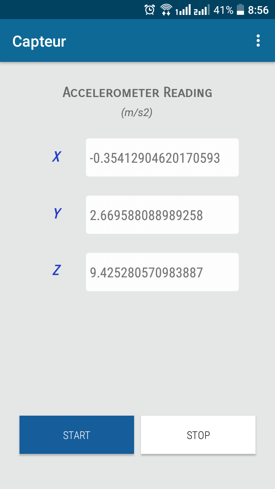

#Capteur

An android app to read Accelerometer sesor output

This App reads the Accelerometer reading from the given API and display acceleration in x,y and z axes.
The app supports above the android version 6.0 (Marshmallow).

Noice in the sensor is removed by adding a threshold of 0.1 m/s2. ( the sensor readings which has difference of 0.1 m/s2 with the last readings are displayed to the users. )

<h3 align="center"> Screen view<h3>

  
  

